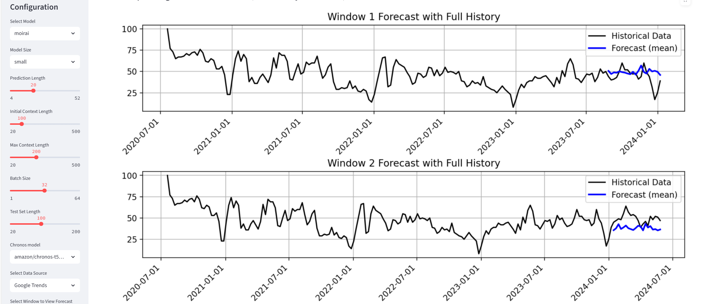
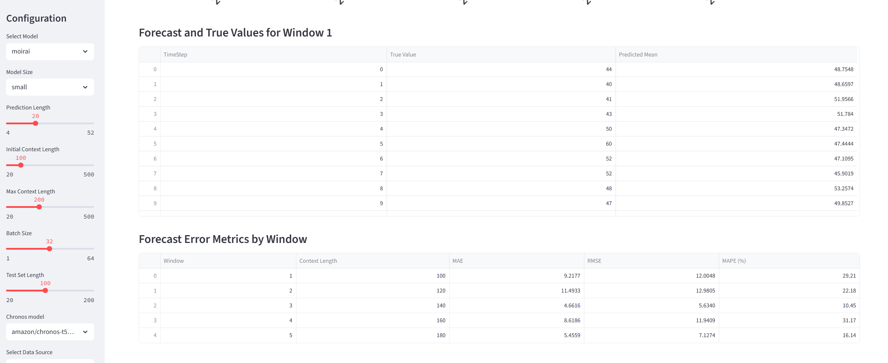
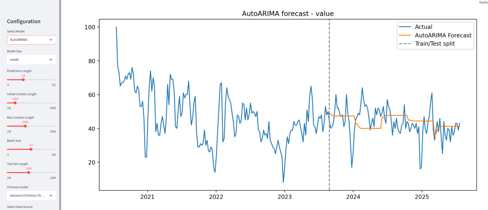

# Student Enrollment Forecasting with Moirai, Auto Models & Streamlit

This project predicts student enrollment trends using advanced time series forecasting techniques.  
It includes:
- **Moirai** models for accurate and robust forecasting.
- **Auto model pipeline** for automated model selection and hyperparameter tuning.
- **Streamlit web app** for interactive visualization and trend exploration.

The dataset is derived from **Google Trends** search interest data (`ts_wide.csv`).

---

## Project Structure

```
├── moirai.yml               # Conda environment configuration
├── sample_moirai.py         # Sample script using Moirai for time series forecasting
├── auto_model.py            # Automated forecasting pipeline
├── streamlit_app.py         # Streamlit dashboard for visualization
├── autoarima_forecast.py    # Auto ARIMA forecasting script
├── ts_wide.csv              # Google Trends-based time series data
├── images/                  # Saved forecast images
└── README.md                # Project documentation
```

---

## Installation

1. **Create and activate the Conda environment**
```bash
conda env create -f moirai.yml
conda activate PhD_Moirai
```

2. **Install additional dependencies (if not already included)**
```bash
pip install streamlit pandas numpy matplotlib plotly
```

---

## Data

The dataset `ts_wide.csv` contains Google Trends search interest data for enrollment-related queries.  
It is in a wide-format time series structure, where each column is a separate query/topic, and rows represent time steps.

---

## Usage

### 1️ Run the Moirai forecasting script
```bash
python sample_moirai.py
```
- Loads historical enrollment-related data.
- Trains a Moirai time series model.
- Outputs predictions and evaluation metrics.

### 2️ Run the Auto Model pipeline
```bash
python auto_model.py
```
- Automatically selects the best forecasting algorithm.
- Performs hyperparameter tuning.
- Saves the best model and predictions.

### 3️ Run the Auto ARIMA forecasting script
```bash
python autoarima_forecast.py
```
- Uses Auto ARIMA for quick forecasting.
- Saves forecast results and plots.

### 4️ Run the Streamlit dashboard
```bash
streamlit run streamlit_app.py
```
- Launches an interactive web app at [http://localhost:8501/](http://localhost:8501/).

---

## Example Forecasting Output





---

## Requirements

- Python 3.13
- Conda
- Moirai
- Pandas, NumPy
- Streamlit
- Matplotlib, Plotly

---

## Author

**Zeen Cheng**  
Massey University  
Email: 2638164080@qq.com  
GitHub: [@ZeenCheng](https://github.com/ZeenCheng)

