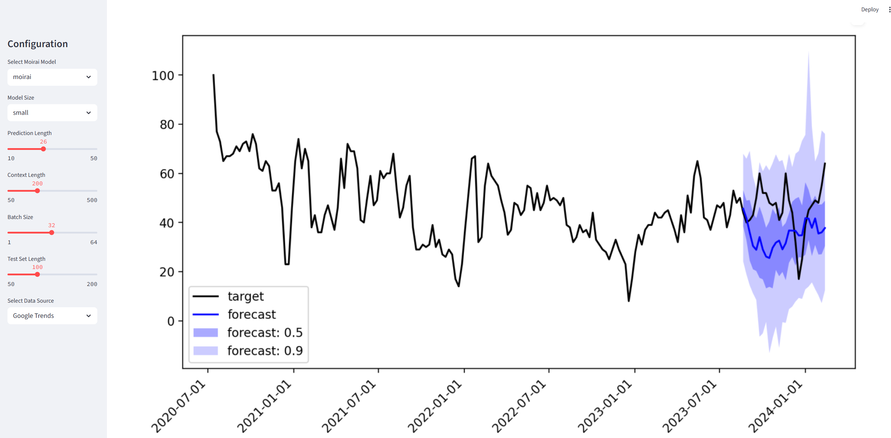
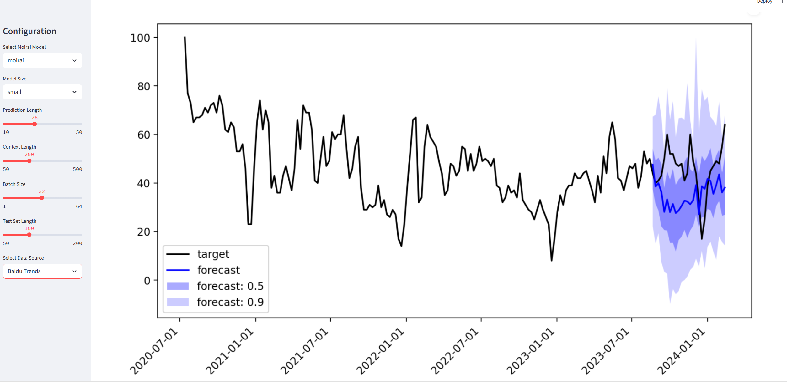

# Student Enrollment Forecasting with Moirai & Streamlit

This project aims to predict student enrollment trends using time series forecasting models. It leverages the **Moirai** library for forecasting and provides a **Streamlit** web interface for visualization. The dataset is based on Google Trends  (`ts_wide.csv`).

## Project Structure

```
├── moirai.yml             # Conda environment configuration
├── sample_moirai.py       # Sample script using Moirai for time series forecasting
├── streamlit_app.py       # Streamlit dashboard for visualization
├── ts_wide.csv            # Google Trends-based time series data
└── README.md              # Project documentation
```


---

##  Installation

### Create and activate the conda environment

```bash
conda env create -f moirai.yml
conda activate PhD_Moirai
```

## Data

The dataset `ts_wide.csv` 
## Usage

### 1. Run the sample forecasting script

```bash
python sample_moirai.py
```

This will generate model outputs using Moirai on the `ts_wide.csv` dataset.

### 2. Run the Streamlit dashboard

```bash
streamlit run streamlit_app.py
```

This will launch an interactive web app at http://localhost:8501/ where you can visualize trends and forecasts.

## Example Forecasting Output




## Requirements

- Python 3.13
- Conda
- Streamlit
- Moirai
- Pandas, NumPy


## Author

**Zeen Cheng**  
Massey University  
Email: 2638164080@qq.com  
GitHub: [@ZeenCheng](https://github.com/ZeenCheng)

